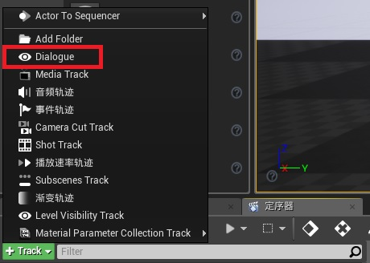
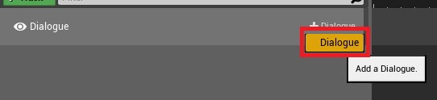
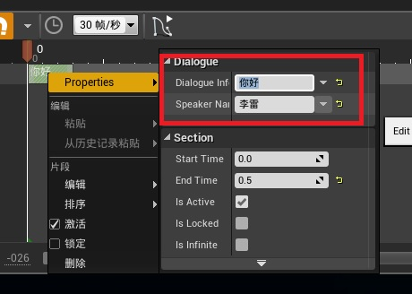
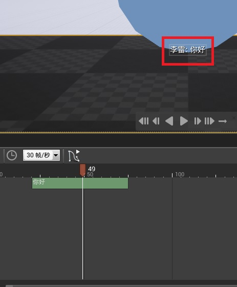

# UE4 Sequencer 字幕轨道插件

## 工程介绍

本工程通过一个示例介绍项目中如何使用Sequencer字幕插件。
插件编辑如下图所示:

游戏内效果如图所示(创建UMG可以做出自己想要的效果):

## UE4版本要求

本插件是基于UE4.19.2开发的，由于UE4.20开始，Epic对Sequencer代码做了较大的重构，所以目前不支持UE4.20以后的版本。各自如有需要，fork后自己修改即可。

## 如何编辑

1. 安装插件后，Sequencer轨道列表中增加一个“Dialogue”的按钮，点击按钮，新增字幕轨道如图:

2. 点击右边的+号按钮，再点击Dialogue添加一个字幕信息,如图:

3. 右边会出现字幕信息的Section，Section的长度表示字幕显示的时间。右键Section，编辑属性信息，SpeakerName表示说话人的姓名，DialogueInfo表示说话内容,如图:

4. 拖动时间轴可以在编辑器上看到字幕的预览，如图:

## 程序需要做哪些工作
程序人员需要在自己的GameMode类设置中继承Dialogue Interface的接口，并且实现ShowDialogueInfo函数，该函数共3个参数，show表示是否要显示字幕UI，true显示，false隐藏;Name表示说话人姓名，Info表示说话内容;通过实现该接口以及创建自己的UMG可以实现字幕UI定制。

## 欢迎你的加入
欢迎更多的人去完善它！